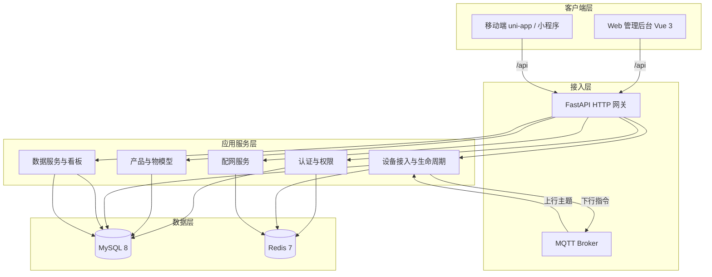
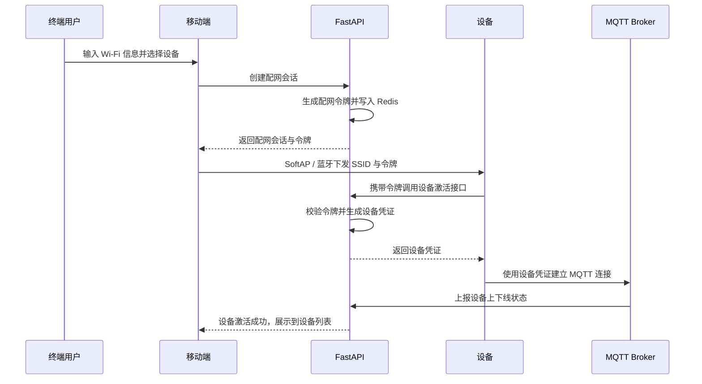
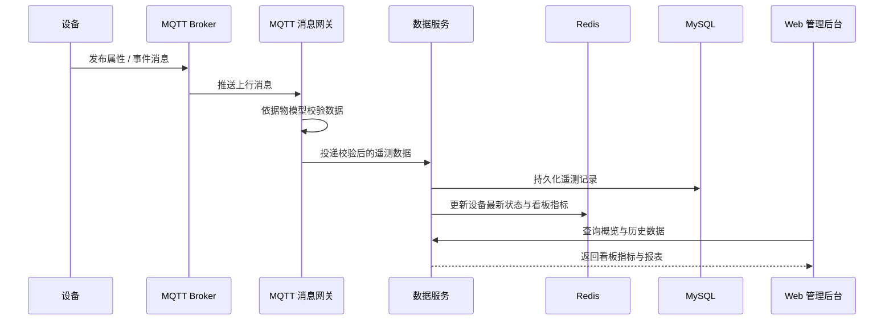

# 架构设计

## 系统概述

link_equipment 采用前后端分离的分层架构，围绕「设备接入」与「设备管理」两条主线组织：设备侧通过配网入网并经 MQTT 上行数据，平台侧通过 FastAPI 提供管理 API，Web 管理后台与 uni-app 移动端共享同一套接口。

整体分为四层：

- 客户端层：Web 管理后台（Vue 3）与移动端（uni-app / 小程序）。
- 接入层：FastAPI HTTP 网关负责管理面请求，MQTT Broker 负责设备面上下行。
- 应用服务层：认证与权限、产品与物模型、设备管理、配网、数据看板等业务服务。
- 数据层：MySQL 存储元数据，Redis 缓存在线状态与会话。

## 技术栈

| 层次 | 组件 | 说明 |
|------|------|------|
| 前端 | Vue 3 + Vite + Element Plus | 管理后台，经反向代理访问 `/api` |
| 移动端 | uni-app / 小程序 | 终端用户配网与设备查看 |
| 后端 | Python 3.11+ / FastAPI | 管理面 API 与设备消息处理 |
| ORM / 迁移 | SQLAlchemy + Alembic | 数据模型与版本化迁移 |
| 设备接入 | MQTT Broker（EMQX / Mosquitto） | 设备长连接与上下行主题 |
| 数据库 | MySQL 8 | 产品、物模型、设备、用户、遥测归档 |
| 缓存 | Redis 7 | 在线状态、令牌、看板热点指标 |
| 部署 | Docker Compose | 一键拉起全部组件 |

## 项目结构（建议）

```text
link_equipment/
├── backend/                  # FastAPI 服务
│   ├── app/
│   │   ├── api/              # 路由与依赖注入
│   │   │   └── v1/           # 版本化路由（auth/products/devices/dashboard）
│   │   ├── core/             # 配置、安全、JWT、日志
│   │   ├── models/           # SQLAlchemy 数据模型
│   │   ├── schemas/          # Pydantic 请求/响应模型
│   │   ├── services/         # 业务逻辑（配网、设备、物模型、看板）
│   │   ├── mqtt/             # MQTT 客户端、主题路由、消息处理
│   │   ├── db/               # 会话管理与初始化
│   │   └── main.py           # 应用入口
│   ├── alembic/              # 数据库迁移脚本
│   ├── tests/
│   └── pyproject.toml
├── web/                      # Vue 3 管理后台
│   ├── src/
│   │   ├── api/              # 接口封装
│   │   ├── views/            # 页面（产品/设备/看板）
│   │   ├── components/
│   │   ├── router/
│   │   └── stores/           # Pinia 状态
│   └── vite.config.ts        # 含 /api 反向代理
├── mobile/                   # uni-app 移动端
│   └── src/
│       ├── pages/            # 登录、配网、设备列表、设备详情
│       └── api/
├── deploy/                   # docker-compose 与各组件配置
│   ├── docker-compose.yml
│   └── mqtt/                 # Broker 配置
└── .monkeycode/docs/         # 项目文档
```

## 核心模块 / 组件

| 模块 | 职责 |
|------|------|
| 认证与权限 | 账号密码登录、JWT 签发与校验、终端用户 / 管理员角色隔离 |
| 产品与物模型 | 产品定义、物模型（属性 / 事件 / 服务）版本管理与校验 |
| 设备接入与生命周期 | 配网会话、设备注册与凭证、MQTT 接入、在线状态与状态流转 |
| 数据服务 / 看板 | 遥测数据消费与落库、概览指标、历史查询与报表导出 |
| MQTT 消息网关 | 订阅设备上行主题、校验物模型、分发到业务服务 |

## 架构图



## 关键流程

### 设备配网与接入



### 遥测上报与看板刷新



## 设计决策

| 决策 | 选择 | 理由 |
|------|------|------|
| 设备上行协议 | MQTT | 消费级设备主流方案，长连接支持状态推送与指令下发 |
| 配网方式 | SoftAP / 蓝牙 | 覆盖无屏消费设备，App / 小程序引导即可完成 |
| 认证模型 | JWT（账号 + 密码） | 无状态，Web 与移动端共用一套登录接口 |
| 租户模型 | 单租户（平台自营） | 匹配当前运营模式，暂不引入多租户隔离复杂度 |
| 在线状态存储 | Redis | 高频读写在线状态，避免直接压测 MySQL |
| 物模型描述 | JSON 结构 | 便于前后端与设备端统一解析，支持产品级扩展 |
| 部署方式 | Docker Compose | 组件边界清晰，一键拉起，后续可平滑迁移到编排平台 |

## 待确认事项

- 物模型属性的数据类型集合（当前约定为 int / float / bool / string / enum / struct）。
- 遥测数据的保留策略与归档周期，会影响 MySQL 表分区或后续引入时序库。
- 配网令牌的有效期与失败重试策略。
- 是否需要 OTA 固件升级、告警规则引擎、实时指令下发等后续能力。
