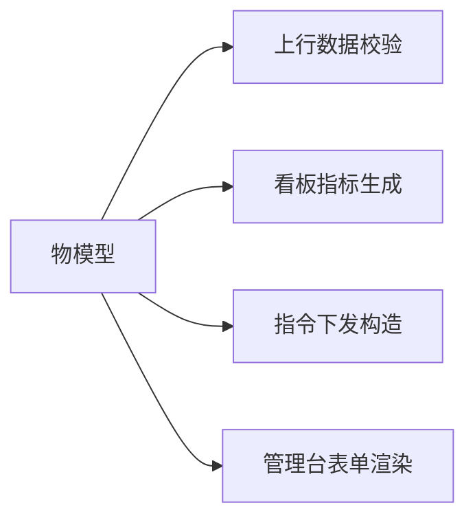

# 物模型

## 概念

物模型（Thing Model）是对某一类设备能力的结构化描述，用来把「设备能做什么」与「平台怎么处理」解耦。每个产品对应一份物模型，该产品下的所有设备共享这份定义。

物模型包含三类元素：

| 元素 | 方向 | 说明 | 示例 |
|------|------|------|------|
| 属性（Property） | 设备 → 平台（可双向） | 设备的可读或可写状态量 | 温度、开关状态 |
| 事件（Event） | 设备 → 平台 | 设备主动上报的一次性通知 | 低电量告警、故障上报 |
| 服务（Service） | 平台 → 设备 | 平台可远端调用的能力 | 重启设备、校准传感器 |

## 组成结构

```json
{
  "version": "1.0.0",
  "properties": [
    {
      "identifier": "temperature",
      "name": "温度",
      "data_type": "float",
      "access_mode": "r",
      "unit": "℃",
      "min": -20,
      "max": 60
    }
  ],
  "events": [
    {
      "identifier": "low_battery",
      "name": "低电量告警",
      "type": "alert",
      "output": [{ "identifier": "battery", "data_type": "int" }]
    }
  ],
  "services": [
    {
      "identifier": "reboot",
      "name": "重启设备",
      "input": [],
      "output": []
    }
  ]
}
```

## 标识符与数据类型

- `identifier`：物模型标识符，产品内唯一，由字母、数字、下划线组成；设备上报必须使用该标识符。
- `data_type`：支持 `int`、`float`、`bool`、`string`、`enum`、`struct`。
- `access_mode`：`r` 只读、`rw` 读写、`w` 只写，用于约束平台可下发的属性。
- 数值型可附带 `min` / `max` / `step`，枚举型可附带取值集合，用于上行校验。

## 在系统中的角色



- 上行校验：MQTT 网关按物模型校验设备上报的标识符与取值范围，非法数据被拒绝并记录。
- 看板指标：数据服务依据物模型中的属性定义生成可查询指标与报表字段。
- 指令下发：平台按服务定义构造下行消息，设备按 `identifier` 执行并回执。
- 表单渲染：管理后台与移动端按物模型动态渲染设备详情，无需为每种设备单独开发页面。

## 版本管理

物模型使用语义化版本号。属性新增属于次版本变更，属性类型或标识符调整属于主版本变更。设备在激活时记录其适配的物模型版本，平台在校验时按版本匹配，避免升级物模型导致存量设备上报失败。

## 相关文档

- [架构设计](../ARCHITECTURE.md)
- [接口定义](../INTERFACES.md)
- [产品与物模型管理](../模块/产品与物模型管理.md)
