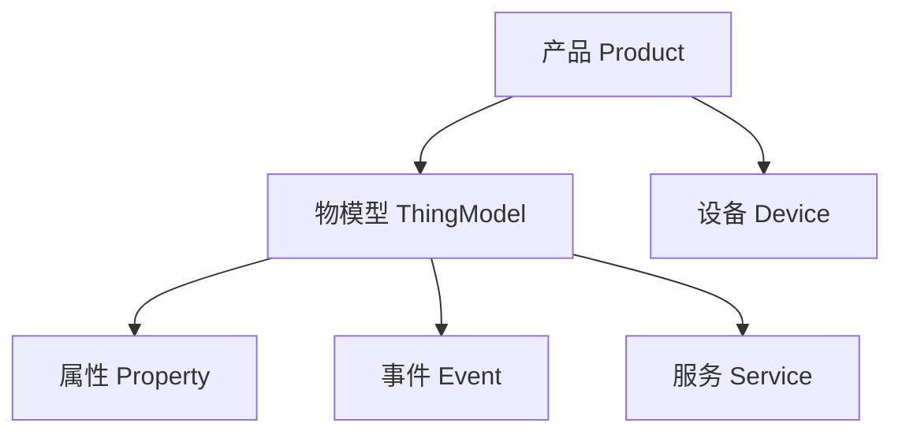

# 产品与物模型管理

## 职责

以产品为单位组织设备类型，用物模型描述设备能力，为设备接入、数据校验和界面渲染提供统一定义。

## 关键能力

- 产品管理：创建与维护产品，分配唯一的 `product_key`。
- 物模型编辑：定义属性、事件、服务，支持类型、取值范围与读写权限配置。
- 版本管理：物模型按语义化版本迭代，设备记录适配版本。
- 校验支撑：为 MQTT 网关提供上行数据校验规则。
- 展示配置：声明主指标、次要指标、趋势指标与界面模板，驱动客户端多品类渲染。

## 领域模型

| 实体 | 关键字段 | 说明 |
|------|---------|------|
| `products` | `id`、`product_key`、`name`、`category`、`display_config`（JSON）、`template`、`created_at` | 产品定义、设备类型与展示配置 |
| `thing_models` | `id`、`product_id`、`version`、`definition`（JSON）、`created_at` | 物模型，按版本保存 |
| `devices` | `id`、`product_id`、... | 归属该产品的设备 |

物模型主体以 JSON 存储，便于整体读写、版本对比与设备端直接解析；属性与服务的检索需求通过解析后的索引字段补充。

## 关键接口

| 方法 | 路径 | 说明 |
|------|------|------|
| GET | `/api/v1/products` | 产品列表 |
| POST | `/api/v1/products` | 创建产品 |
| GET | `/api/v1/products/{product_id}/thing-model` | 查询物模型 |
| PUT | `/api/v1/products/{product_id}/thing-model` | 保存物模型 |
| GET | `/api/v1/products/{product_id}/display-config` | 查询展示配置 |
| PUT | `/api/v1/products/{product_id}/display-config` | 保存展示配置 |

## 设计要点

- `product_key` 需全局唯一且不可修改，作为 MQTT 主题的一部分参与路由。
- 保存物模型时执行结构校验：标识符唯一性、数据类型合法性、取值范围合理性。
- 物模型变更采用「新增版本」而非原地覆盖，保障存量设备仍可按旧版本校验。
- 删除产品前需校验不存在关联设备，存在关联时拒绝并返回 `409`。
- 物模型定义中被前端用于表单渲染，字段名称与单位需提供中文文案。
- 展示配置引用的标识符必须存在于当前物模型版本，保存时一并校验。
- 展示配置未配置时按物模型只读数值属性自动生成默认值，保证新品类开箱可用。

## 相关文档

- [物模型](../专有概念/物模型.md)
- [设备类型与展示配置](../专有概念/设备类型与展示配置.md)
- [接口定义](../INTERFACES.md)
