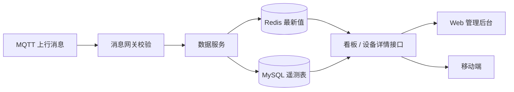

# 数据看板与报表

## 职责

消费设备上行遥测数据，生成可查询的概览指标与历史报表，为运营与运维提供数据视图。

## 关键能力

- 遥测消费：接收 MQTT 网关校验后的属性与事件数据并持久化。
- 实时状态：在 Redis 中维护设备最新状态与最新属性值，支撑设备详情页秒开。
- 概览看板：设备总数、在线数、在线率、活跃设备数与趋势曲线。
- 历史查询：按设备与属性标识符、时间范围分页查询历史数据。
- 报表导出：生成设备汇总报表并提供下载。

## 数据处理链路

## 数据模型（建议）

| 表 | 关键字段 | 说明 |
|----|---------|------|
| `telemetry_records` | `id`、`device_id`、`identifier`、`value_num`、`value_str`、`reported_at` | 遥测数据点 |
| `device_events` | `id`、`device_id`、`identifier`、`payload`（JSON）、`reported_at` | 设备事件 |
| `device_daily_stats` | `device_id`、`stat_date`、`online_seconds`、`report_count` | 日汇总，供报表使用 |

Redis 键设计：

| 键 | 说明 |
|----|------|
| `device:status:{device_id}` | 在线状态 |
| `device:latest:{device_id}` | 最新属性值（Hash，字段为标识符） |
| `dashboard:overview` | 概览指标缓存，短 TTL |

## 关键接口

| 方法 | 路径 | 说明 |
|------|------|------|
| GET | `/api/v1/dashboard/overview` | 概览指标 |
| GET | `/api/v1/dashboard/trends` | 趋势数据 |
| GET | `/api/v1/devices/{device_id}/telemetry` | 历史遥测查询 |
| POST | `/api/v1/reports/device-summary` | 生成汇总报表 |

## 设计要点

- 数值型与字符串型属性分列存储（`value_num` / `value_str`），兼顾范围查询与展示。
- 遥测写入采用批量落库，避免高频单条插入；写入失败进入重试队列。
- 概览指标使用 Redis 短 TTL 缓存，避免每次请求全表统计。
- 历史数据按时间范围查询必须强制限定区间与分页，防止大范围扫描。
- 遥测数据保留周期与归档策略待定，数据量增长后可平滑迁移至时序库。
- 报表生成异步执行，完成后返回 `report_id`，通过下载接口获取文件。

## 相关文档

- [接口定义](../INTERFACES.md)
- [架构设计](../ARCHITECTURE.md)
