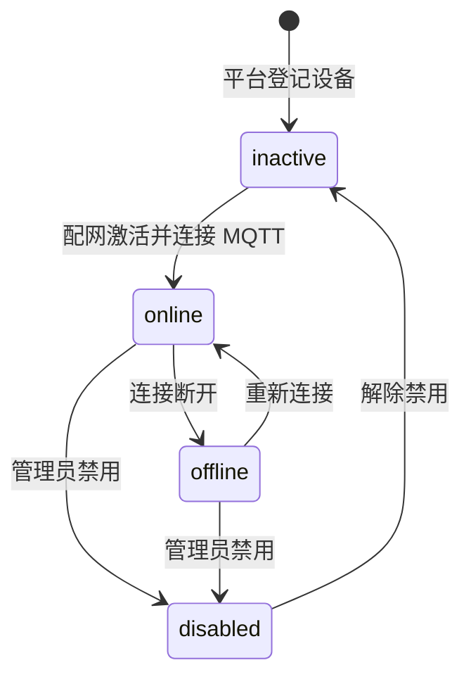

# 设备接入与生命周期

## 职责

负责设备从配网、激活、连接到状态流转的全过程，是平台与物理设备之间的边界模块。

## 关键能力

- 配网会话：终端用户发起配网，平台生成一次性配网令牌并下发到设备。
- 设备激活：设备凭配网令牌换取设备凭证，完成注册。
- MQTT 接入：设备使用设备凭证连接 Broker，平台通过 LWT 感知上下线。
- 状态管理：维护 `inactive → online → offline → disabled` 状态流转。
- 归属绑定：支持设备与终端用户 / 家庭空间的绑定与解绑。

## 状态流转

## 数据模型（建议）

| 表 | 关键字段 | 说明 |
|----|---------|------|
| `devices` | `id`、`product_id`、`device_sn`、`device_name`、`status`、`owner_id`、`activated_at`、`last_online_at` | 设备台账 |
| `device_credentials` | `device_id`、`secret_hash`、`created_at`、`revoked_at` | 设备凭证，仅存哈希 |
| `provisioning_sessions` | `id`、`product_id`、`channel`、`token_hash`、`status`、`expires_at` | 配网会话 |
| `device_bindings` | `device_id`、`owner_id`、`bound_at` | 设备与用户 / 空间绑定关系 |

在线状态不落 MySQL，使用 Redis 键 `device:status:{device_id}` 存储，并设置合理的过期时间以兜底异常下线。

## 关键接口

| 方法 | 路径 | 说明 |
|------|------|------|
| POST | `/api/v1/provisioning/sessions` | 创建配网会话 |
| GET | `/api/v1/provisioning/sessions/{session_id}` | 查询配网会话状态 |
| POST | `/api/v1/activation` | 设备侧激活 |
| GET | `/api/v1/devices` | 设备列表 |
| POST | `/api/v1/devices/{device_id}/bind` | 绑定设备 |
| GET | `/api/v1/devices/{device_id}/status` | 查询在线状态 |

## 设计要点

- 配网令牌一次性使用，有效期建议 5 分钟，校验后立即失效，防止重放。
- 设备凭证下发后仅在设备端保存，平台侧只保存哈希，支持吊销与重新签发。
- 上下线状态优先信任 Broker 的 LWT 消息；结合 Redis 过期时间兜底设备异常断电场景。
- 设备删除前需先解绑并吊销凭证，避免产生孤立连接。
- 绑定接口需校验设备是否已被其他用户绑定，冲突时返回 `409`。
