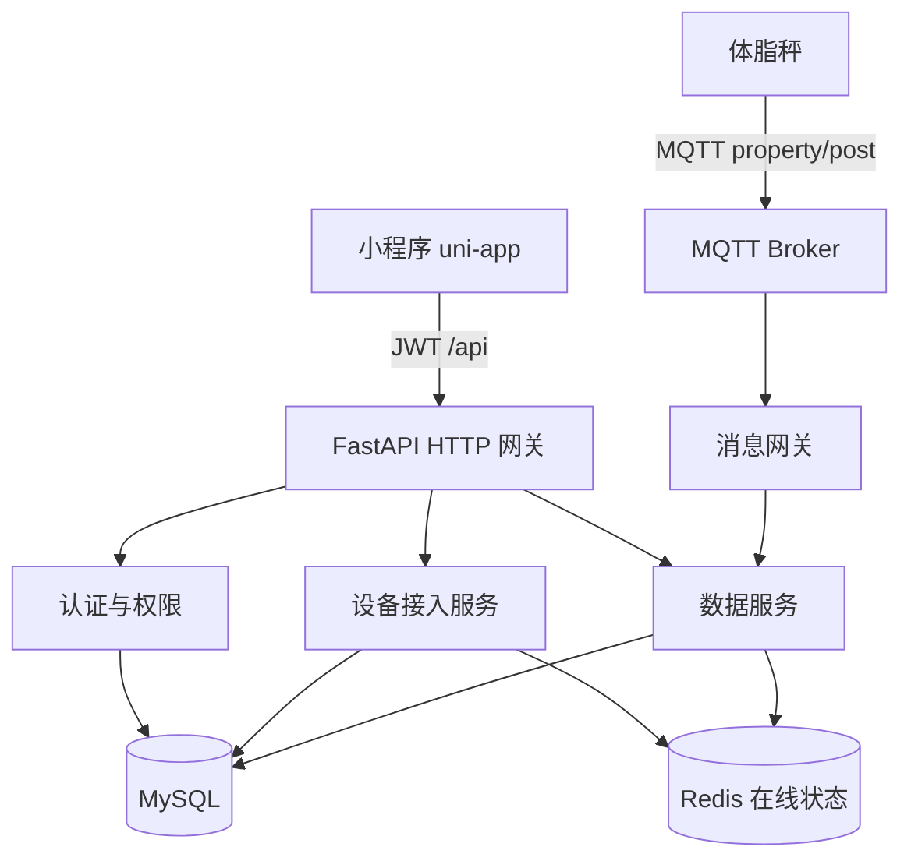

# 小程序体脂秤数据查看

Feature Name: miniapp-scale-data-view
Updated: 2026-09-17

## Description

终端用户在小程序完成体脂秤绑定后，可查看该设备上的全部测量数据。详情页默认展示近 30 天记录，核心指标为体重、体脂率、肌肉量、水分率。数据按设备归属：绑定用户可查看该秤的全部测量，接口在返回前校验绑定关系。

本功能复用设备绑定、MQTT 遥测落库与 JWT 认证，在数据服务上增加面向小程序的测量聚合接口，并在 uni-app 增加设备列表与数据详情页。

## Architecture



查询路径：

1. 小程序携带 JWT 请求设备列表 / 测量数据。
2. 网关校验令牌与 `user` 角色。
3. 设备服务确认当前用户与 `device_id` 存在有效绑定。
4. 数据服务按设备聚合测量记录并返回核心指标。

上报路径保持现有链路：秤经 MQTT 上报属性，消息网关按物模型校验后写入 `telemetry_records` 与 Redis 最新值。

## Components and Interfaces

### 后端

| 组件 | 职责 |
|------|------|
| `DeviceBindingGuard` | 校验当前用户与设备的有效绑定，未绑定返回 403 |
| `MeasurementService` | 将同一 `msg_id` / 时间窗口内的属性点聚合成一次测量记录 |
| `MiniappDeviceAPI` | 小程序设备列表、最近一次测量、历史测量、趋势数据 |

新增 / 扩展接口：

| 方法 | 路径 | 说明 |
|------|------|------|
| GET | `/api/v1/me/devices` | 当前用户已绑定设备列表，含名称与在线状态 |
| GET | `/api/v1/me/devices/{device_id}/measurements/latest` | 最近一次测量记录 |
| GET | `/api/v1/me/devices/{device_id}/measurements` | 历史测量，默认 `start=now-30d`，每页 20 条 |
| GET | `/api/v1/me/devices/{device_id}/measurements/trends` | 体重与体脂率趋势点 |

历史查询参数：

| 参数 | 默认 | 说明 |
|------|------|------|
| `start` | 当前时间减 30 天 | ISO 8601 |
| `end` | 当前时间 | ISO 8601 |
| `page` | 1 | 页码 |
| `page_size` | 20 | 单页条数，上限 100 |

测量记录响应：

```json
{
  "code": 0,
  "message": "ok",
  "data": {
    "device_id": "dev_0001",
    "measured_at": "2026-09-16T07:30:00Z",
    "weight": 68.2,
    "body_fat": 22.4,
    "muscle_mass": 48.1,
    "body_water": 55.6
  }
}
```

未上报的核心指标字段值为 `null`，小程序展示为 `--`。

权限约定：

- 上述 `/me/devices*` 接口仅对 `user` 角色开放。
- 每次查询先校验绑定关系；管理员查看运营数据继续走既有 `/dashboard` 与 `/devices/{id}/telemetry`。
- 现有按属性点返回的遥测接口保留，供管理后台使用。小程序走聚合后的测量记录接口，避免前端自行拼装一次称重。

### 小程序

| 页面 | 路径建议 | 职责 |
|------|---------|------|
| 设备列表 | `pages/device/list` | 展示已绑定体脂秤，空状态引导添加设备 |
| 数据详情 | `pages/device/detail` | 最近一次测量、近 30 天趋势、历史列表、下拉刷新 |

详情页布局顺序：设备名称与在线状态 → 最近一次测量卡片 → 体重 / 体脂率趋势图 → 历史记录列表。

## Data Models

复用既有表，不新增测量主表。一次测量仅按 MQTT 消息 `id` 聚合：同一 `id` 下的多条属性点组成一条测量记录。缺少 `id` 的上行消息不进入测量列表。

| 来源 | 用途 |
|------|------|
| `device_bindings` | `owner_id` + `device_id` 判定数据可见性 |
| `devices` | 设备名称、产品、激活状态 |
| `telemetry_records` | 属性点存储，`device_id` + `identifier` + `reported_at` |
| Redis `device:status:{device_id}` | 在线状态 |
| Redis `device:latest:{device_id}` | 最新属性 Hash，支撑最近一次测量秒开 |

体脂秤物模型核心属性：

| identifier | 名称 | 类型 | 单位 |
|------------|------|------|------|
| `weight` | 体重 | float | kg |
| `body_fat` | 体脂率 | float | % |
| `muscle_mass` | 肌肉量 | float | kg |
| `body_water` | 水分率 | float | % |

聚合规则：

- 按 MQTT 消息 `id` 分组，同一 `id` 视为一次称重。
- 缺少 `id` 的属性点跳过测量聚合，仅保留原始遥测点供管理后台查询。
- 测量时间取该组内最早的 `reported_at`。
- 同组内同一 `identifier` 出现多次时，取最后一次值。

查询约束：

- `end - start` 上限 366 天。
- 历史列表强制分页。
- 趋势接口最多返回 200 个点；超出时按时间均匀抽样。

## Correctness Properties

- 绑定校验先于数据查询：未绑定用户无法获得该设备的任何测量字段。
- 测量列表按 `measured_at` 倒序，分页稳定（同一时间范围重复请求结果一致）。
- 核心四项以外的属性不出现在小程序测量接口响应中。
- 最近一次测量接口与 Redis 最新值一致；Redis 缺失时回源 MySQL 最近一组聚合结果。
- 秤上报后 10 秒内，测量接口可查询到该次记录。

## Error Handling

| 场景 | 处理 |
|------|------|
| 未登录或 JWT 失效 | 返回 401，小程序跳转登录页 |
| 用户未绑定目标设备 | 返回 403，详情页提示无权限 |
| 设备不存在 | 返回 404 |
| 设备无测量记录 | 返回 200，`data` 为 `null` 或空列表，页面展示「暂无测量数据」 |
| 时间范围非法或超过 366 天 | 返回 400 |
| 遥测写入延迟 | 下拉刷新重试；页面保留上次成功数据 |
| 绑定已解除后再次打开详情 | 返回 403，返回设备列表并刷新 |

## Test Strategy

- 单元测试：绑定守卫（已绑定 / 未绑定 / 已解绑）、测量聚合（同一 `id` 多属性、无 `id` 跳过、重复 identifier 取最后一次）。
- API 测试：`/me/devices` 仅返回当前用户设备；历史默认 30 天；核心指标缺失为 `null`；403 / 401 路径。
- 时效测试：写入一条测量后 10 秒内 latest 接口可读。
- 小程序页面：空列表、有数据、少于 2 点隐藏趋势图、下拉刷新更新最近一次测量。

## References

- [项目概述](../../docs/INDEX.md)
- [架构设计](../../docs/ARCHITECTURE.md)
- [接口定义](../../docs/INTERFACES.md)
- [数据看板与报表](../../docs/模块/数据看板与报表.md)
- [设备接入与生命周期](../../docs/模块/设备接入与生命周期.md)
- [需求文档](./requirements.md)
