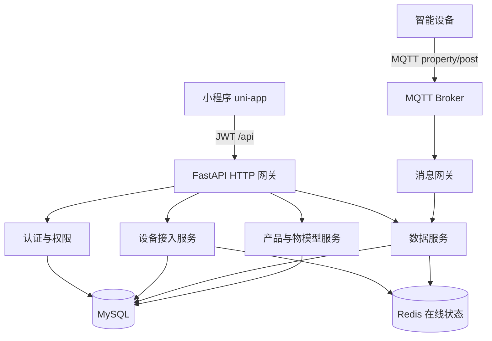

# 小程序设备数据查看（物模型驱动）

Feature Name: miniapp-scale-data-view
Updated: 2026-09-17

## Description

终端用户在小程序绑定智能设备后，可查看该设备的数据。数据界面采用「物模型驱动 + 展示配置」的通用框架：设备列表、详情、历史与趋势均由产品级配置决定渲染内容，体脂秤是首个落地的设备类型。新增设备类型时只需配置物模型与展示配置，客户端数据框架无需改动。

## Architecture



查询路径：

1. 小程序携带 JWT 请求设备列表与设备详情。
2. 网关校验令牌与 `user` 角色。
3. 设备服务确认当前用户与 `device_id` 存在有效绑定。
4. 产品服务返回该设备所属产品的设备类型与展示配置。
5. 数据服务按设备返回数据记录，客户端按展示配置渲染指标与趋势。

上报路径保持现有链路：设备经 MQTT 上报属性，消息网关按物模型校验后写入 `telemetry_records` 与 Redis 最新值。

## Components and Interfaces

### 后端

| 组件 | 职责 |
|------|------|
| `DeviceBindingGuard` | 校验当前用户与设备的有效绑定，未绑定返回 403 |
| `DeviceTypeRegistry` | 按产品维护设备类型与界面模板标识，驱动客户端选择展示模板 |
| `DisplayConfigService` | 读取产品展示配置，未配置时按物模型生成默认配置 |
| `RecordService` | 将同一 MQTT 消息 `id` 的属性点聚合成一条设备数据记录 |
| `MiniappDeviceAPI` | 小程序设备列表、设备详情、数据记录与趋势 |

新增 / 扩展接口（全部与设备类型无关）：

| 方法 | 路径 | 说明 |
|------|------|------|
| GET | `/api/v1/me/devices` | 当前用户已绑定设备列表，含名称、设备类型、在线状态 |
| GET | `/api/v1/me/devices/{device_id}` | 设备详情，含设备类型、界面模板标识与展示配置 |
| GET | `/api/v1/me/devices/{device_id}/records/latest` | 最近一次数据记录 |
| GET | `/api/v1/me/devices/{device_id}/records` | 历史数据记录，默认 `start=now-30d`，每页 20 条 |
| GET | `/api/v1/me/devices/{device_id}/records/trends` | 按 `identifier` 查询趋势点，支持多个指标 |

历史查询参数：

| 参数 | 默认 | 说明 |
|------|------|------|
| `identifier` | 展示配置中的趋势指标 | 物模型属性标识符，可多个 |
| `start` | 当前时间减 30 天 | ISO 8601 |
| `end` | 当前时间 | ISO 8601 |
| `page` | 1 | 页码 |
| `page_size` | 20 | 单页条数，上限 100 |

设备详情响应（客户端据此渲染）：

```json
{
  "code": 0,
  "message": "ok",
  "data": {
    "device_id": "dev_0001",
    "device_name": "客厅体脂秤",
    "status": "online",
    "category": "body_scale",
    "template": "body_scale",
    "display_config": {
      "primary_metrics": ["weight"],
      "secondary_metrics": ["body_fat", "muscle_mass", "body_water"],
      "trend_metrics": ["weight", "body_fat"],
      "list_metrics": ["weight", "body_fat", "muscle_mass", "body_water"]
    }
  }
}
```

数据记录响应（指标数组，与设备类型解耦）：

```json
{
  "code": 0,
  "message": "ok",
  "data": {
    "device_id": "dev_0001",
    "recorded_at": "2026-09-16T07:30:00Z",
    "metrics": [
      { "identifier": "weight", "name": "体重", "value": 68.2, "unit": "kg" },
      { "identifier": "body_fat", "name": "体脂率", "value": 22.4, "unit": "%" },
      { "identifier": "muscle_mass", "name": "肌肉量", "value": 48.1, "unit": "kg" },
      { "identifier": "body_water", "name": "水分率", "value": 55.6, "unit": "%" }
    ]
  }
}
```

未上报的指标在 `metrics` 中不出现，客户端按展示配置补「--」占位。数值型趋势点：

```json
{
  "code": 0,
  "message": "ok",
  "data": {
    "series": [
      {
        "identifier": "weight",
        "name": "体重",
        "unit": "kg",
        "points": [{ "time": "2026-09-16T07:30:00Z", "value": 68.2 }]
      }
    ]
  }
}
```

权限约定：

- 上述 `/me/devices*` 接口仅对 `user` 角色开放。
- 每次查询先校验绑定关系；管理员查看运营数据继续走既有 `/dashboard` 与 `/devices/{id}/telemetry`。
- 现有按属性点返回的遥测接口保留，供管理后台使用。小程序走聚合后的数据记录接口，避免前端自行拼装一次上报。

### 小程序

| 页面 | 路径建议 | 职责 |
|------|---------|------|
| 设备列表 | `pages/device/list` | 展示已绑定设备，空状态引导添加设备 |
| 通用数据详情 | `pages/device/detail` | 按展示配置渲染最近一次、趋势与历史 |
| 体脂秤专属详情 | `pages/device/body-scale` | 在通用详情基础上增加称重引导与体成分展示 |
| 添加设备 | `pages/device/add` | 配网引导，按设备类型选择配网方式 |

通用详情页布局顺序：设备名称与在线状态 → 最近一次数据卡片（主指标 + 次要指标）→ 趋势图（按 `trend_metrics`）→ 历史记录列表（按 `list_metrics`）。

模板选择规则：客户端按设备详情中的 `template` 字段选择页面；未知模板回退到 `pages/device/detail`。专属模板复用通用组件，只替换差异区域。

## Data Models

复用既有表，不新增数据记录主表。一次数据记录仅按 MQTT 消息 `id` 聚合：同一 `id` 下的多条属性点组成一条记录。缺少 `id` 的上行消息不进入记录列表。

| 来源 | 用途 |
|------|------|
| `device_bindings` | `owner_id` + `device_id` 判定数据可见性 |
| `devices` | 设备名称、`product_id`、激活状态 |
| `products` | `category`（设备类型）、`display_config`（JSON）、`template` |
| `thing_models` | 属性定义（名称、单位、数据类型），用于渲染指标 |
| `telemetry_records` | 属性点存储，`device_id` + `identifier` + `reported_at` |
| Redis `device:status:{device_id}` | 在线状态 |
| Redis `device:latest:{device_id}` | 最新属性 Hash，支撑最近一次记录秒开 |

展示配置结构（存于产品）：

```json
{
  "primary_metrics": ["weight"],
  "secondary_metrics": ["body_fat", "muscle_mass", "body_water"],
  "trend_metrics": ["weight", "body_fat"],
  "list_metrics": ["weight", "body_fat", "muscle_mass", "body_water"],
  "template": "body_scale"
}
```

| 字段 | 说明 |
|------|------|
| `primary_metrics` | 详情页主指标，取首个作为大数值展示 |
| `secondary_metrics` | 详情页次要指标，网格展示 |
| `trend_metrics` | 需要绘制趋势图的指标 |
| `list_metrics` | 历史列表每行展示的指标 |
| `template` | 客户端界面模板标识，缺省为通用模板 |

默认生成规则：产品未配置时，取物模型中 `access_mode` 为 `r` 或 `rw` 的属性，数值型（`int` / `float`）前 3 项作为 `trend_metrics`，首个作为 `primary_metrics`，其余作为 `secondary_metrics` 与 `list_metrics`。

已落地设备类型示例：

| 设备类型 | category | 主指标 | 趋势指标 |
|---------|----------|--------|---------|
| 体脂秤 | `body_scale` | `weight` | `weight`、`body_fat` |
| 温湿度计 | `thermo_hygrometer` | `temperature` | `temperature`、`humidity` |
| 智能插座 | `smart_plug` | `power` | `power` |

聚合规则：

- 按 MQTT 消息 `id` 分组，同一 `id` 视为一次上报。
- 缺少 `id` 的属性点跳过记录聚合，仅保留原始遥测点供管理后台查询。
- 记录时间取该组内最早的 `reported_at`。
- 同组内同一 `identifier` 出现多次时，取最后一次值。

查询约束：

- `end - start` 上限 366 天。
- 历史列表强制分页。
- 趋势接口单个指标最多返回 200 个点；超出时按时间均匀抽样。

## 设备类型扩展机制

新增设备类型只需四步，无需改动客户端数据框架：


1. 创建产品，定义物模型属性（名称、单位、数据类型）。
2. 配置展示配置；未配置时由物模型自动生成默认值。
3. 设备按物模型上报属性，记录按 MQTT `id` 聚合。
4. 小程序读取设备详情的展示配置，动态渲染指标与趋势。

扩展边界：

- 通用能力（列表、最近一次、历史、趋势、权限）走同一套接口与页面。
- 需要专属交互的品类通过 `template` 挂载专用页面，内部复用通用组件。
- 新增指标类型（如枚举、结构体）需在客户端补对应的展示组件；数值型指标开箱可用。

## Correctness Properties

- 绑定校验先于数据查询：未绑定用户无法获得该设备的任何数据字段。
- 数据记录列表按 `recorded_at` 倒序，分页稳定（同一时间范围重复请求结果一致）。
- 数据记录响应中的指标集合由展示配置决定，未配置指标不出现在响应中。
- 最近一次记录接口与 Redis 最新值一致；Redis 缺失时回源 MySQL 最近一组聚合结果。
- 设备上报后 10 秒内，数据记录接口可查询到该次记录。
- 新增设备类型不新增接口：仅通过产品配置即可完成接入。

## Error Handling

| 场景 | 处理 |
|------|------|
| 未登录或 JWT 失效 | 返回 401，小程序跳转登录页 |
| 用户未绑定目标设备 | 返回 403，详情页提示无权限 |
| 设备不存在 | 返回 404 |
| 设备无数据记录 | 返回 200，`data` 为 `null` 或空列表，页面展示「暂无数据」 |
| 产品未配置展示配置 | 按物模型生成默认配置 |
| 客户端遇到未知模板 | 回退通用数据详情页 |
| 时间范围非法或超过 366 天 | 返回 400 |
| 上报写入延迟 | 下拉刷新重试；页面保留上次成功数据 |
| 绑定已解除后再次打开详情 | 返回 403，返回设备列表并刷新 |

## Test Strategy

- 单元测试：绑定守卫（已绑定 / 未绑定 / 已解绑）、记录聚合（同一 `id` 多属性、无 `id` 跳过、重复 identifier 取最后一次）、默认展示配置生成。
- API 测试：`/me/devices` 仅返回当前用户设备；历史默认 30 天；未配置指标不出现在响应；403 / 401 路径；未知模板回退。
- 扩展性测试：新增一个温湿度产品，仅配置物模型与展示配置，验证小程序可渲染主指标与趋势且未新增接口。
- 时效测试：写入一条记录后 10 秒内 latest 接口可读。
- 小程序页面：空列表、有数据、少于 2 点隐藏趋势图、下拉刷新更新最近一次记录、未知模板回退。

## References

- [项目概述](../../docs/INDEX.md)
- [架构设计](../../docs/ARCHITECTURE.md)
- [接口定义](../../docs/INTERFACES.md)
- [物模型](../../docs/专有概念/物模型.md)
- [设备类型与展示配置](../../docs/专有概念/设备类型与展示配置.md)
- [数据看板与报表](../../docs/模块/数据看板与报表.md)
- [设备接入与生命周期](../../docs/模块/设备接入与生命周期.md)
- [需求文档](./requirements.md)
